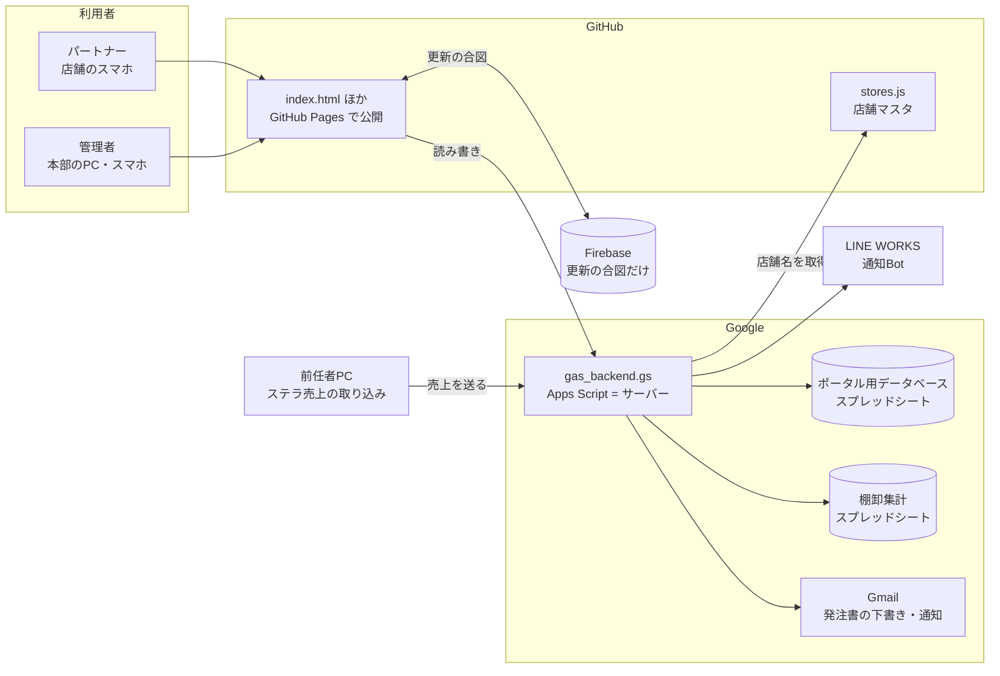
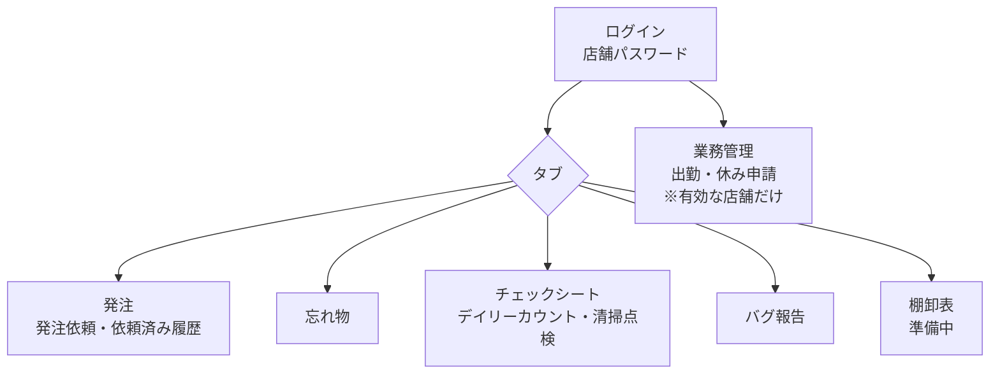
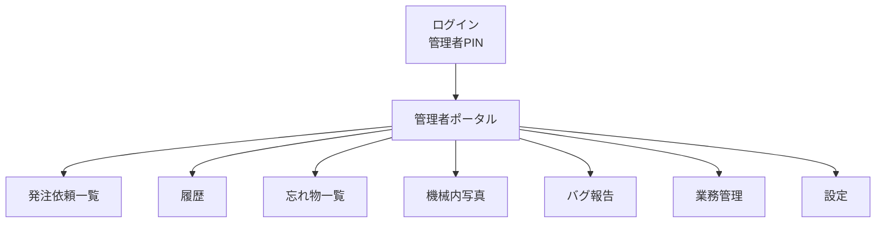
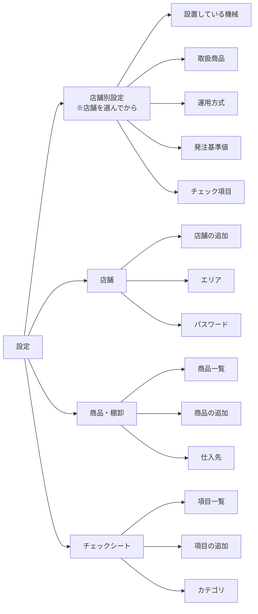
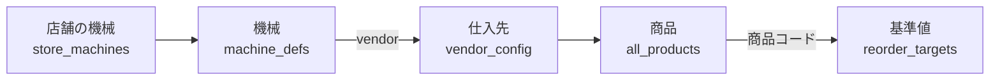
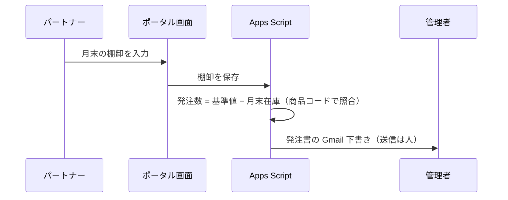
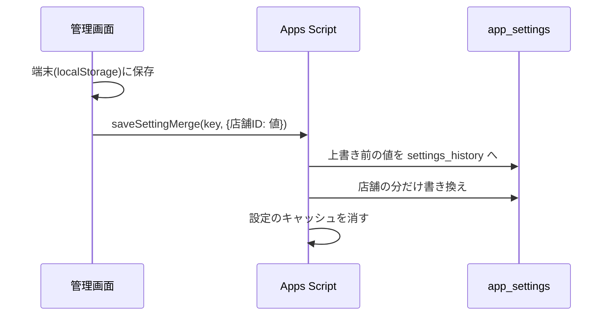

# 社内ポータル 設計図

最終更新: 2026-10-09

社内ポータルが「どの部品で」「どうつながって」「どこにデータを持っているか」を1枚にまとめた資料です。
引き継ぎの順番は [HANDOVER.md](HANDOVER.md)（最初に読む）→ この設計図 → [README.md](README.md) → [CLAUDE.md](CLAUDE.md)（デプロイ手順・過去の事故）です。

> ⚠️ このリポジトリは公開（Public）です。スプレッドシートID・パスワード・APIキーはここに書きません（HANDOVER.md 1-2 のドキュメントにあります）。

---

## 1. 全体の部品

| 部品 | 役割 | 変更の反映方法 |
|---|---|---|
| `index.html` | 画面のすべて（パートナー用・管理者用、処理も全部この1ファイル） | `main` へ push → 数十秒で公開 |
| `stores.js` | 店舗ID・店舗名の一覧 | 同上 |
| `guide.html` / `admin-guide.html` | パートナー用・管理者用の操作マニュアル | 同上 |
| `gas_backend.gs` | サーバー（データの保存・読み出し・通知・発注書づくり） | `gh workflow run deploy-gas.yml --repo selfcafe/internal-web-system --ref main` |
| ポータル用データベース | 発注・設定・チェックシート・出勤・忘れ物など | 人は直接セルを編集しない（画面から変える） |
| 棚卸集計スプレッドシート | 棚卸の記録・店舗タブ・ステラ売上 | 見方は HANDOVER.md 1-1 |
| Firebase | 「データが更新された」の合図だけ（中身は持たない） | Firebase コンソール |

---

## 2. 画面の地図

### 2-1. パートナー（店舗）用

### 2-2. 管理者用

### 2-3. 設定画面のメニュー（2026-10-09 にページ分け）

左にメニュー、右に中身、上にパンくず（例: `設定 › 店舗別設定 › 発注基準値`）。スマホではメニューが上に並びます。
左メニューはアコーディオンで、大分類を押すと中身の一覧が開閉するだけ（ページは切り替わらない。いくつでも開いたままにでき、開閉の状態はタブ内に記録）。中身の項目を押したときだけページが切り替わります。
開いているページだけを作るので軽く、再読み込みしても同じページに戻ります（sessionStorage に記録）。

**メニューの定義は `index.html` の `SETTINGS_MENU` の1か所だけ**です。左メニュー・パンくず・ページ本体はこの表から自動で作られます。

ページを足すときの手順:
1. HTML を返す関数を書く（例: `function _spNewPage() { return '...'; }`）。
2. `SETTINGS_MENU` の該当グループの `pages` に `{ key:'newpage', label:'表示名', build:_spNewPage }` を1行足す。
3. 店舗ごとの設定なら `build:() => _spStoreCfg(...)` で包む（店舗の選択欄が付き、選んだ店舗がページ間で引き継がれる）。

---

## 3. データの持ち方

### 3-1. ポータル用データベースのシート

| シート | 中身 |
|---|---|
| `app_settings` | 設定の一覧（`key` と `value` の2列。value は JSON）。下の 3-2 |
| `settings_history` | 設定を上書きする前の値の記録（追記だけ。復旧用） |
| 発注・チェックシート・出勤・休み申請・忘れ物・業務連絡など | 機能ごとの記録 |

### 3-2. 主な設定（`app_settings` の key）

店舗ごとの設定は `{店舗ID: 値}` の形です。

| key | 中身 | 画面 |
|---|---|---|
| `custom_stores` / `deleted_stores` / `store_regions` | 画面から追加した店舗・削除した店舗・店舗のエリア | 設定 › 店舗 |
| `store_passwords` | 店舗パスワード（**中身を外に出さない**） | 設定 › 店舗 › パスワード |
| `store_machines` | 設置している機械 `{店舗ID: ['100rs','cs3','jcc']}` | 設定 › 店舗別設定 › 設置している機械 |
| `machine_defs` | 機械の種類 `[{key, label, vendor}]`（未設定なら初期値3種） | 同上の「機械の種類を追加・削除する」 |
| `store_product_cfg` | 店舗ごとの「取り扱わない商品」のリスト（除外リスト。空なら全商品） | 設定 › 店舗別設定 › 取扱商品 |
| `store_operation_type` | セミオペ／フルオペ | 設定 › 店舗別設定 › 運用方式 |
| `reorder_targets` | 月初発注の基準値 `{店舗ID: {商品コード: 個数}}` | 設定 › 店舗別設定 › 発注基準値 |
| `store_checksheet_cfg` | 店舗ごとの「実施しないチェック項目」のリスト | 設定 › 店舗別設定 › チェック項目 |
| `all_products` / `deleted_products` | 商品一覧（**商品の正はこちら**。index.html の `PRODUCTS` は初期値だけ）・削除した商品 | 設定 › 商品・棚卸 |
| `vendor_config` | 仕入先（商品のグループ） | 設定 › 商品・棚卸 › 仕入先 |
| `all_checksheet_items` / `checksheet_categories` | チェック項目・カテゴリ | 設定 › チェックシート |
| `attendance_*` | 業務管理（出勤）の設定 | 業務管理 |
| `machine_photo_*` | 機械内写真の設定 | 機械内写真 |

**設定を新しく増やすときは**、`index.html` の3か所に足します（足りないと別の端末に反映されません）:
1. `_loadSettings()` の読み込み（`if (r.key === '...') localStorage.setItem(...)`）
2. 同じ関数の「サーバーに無ければ端末の値を送る」部分
3. `syncAllStoreDataToGas()` の一覧

店舗ごとの設定を1店舗だけ保存するときは `_gasMergeSetting(key, {店舗ID: 値})` を使います（他の店舗の値を消さないため。2026-08-29 の事故の対策）。

### 3-3. 機械と商品のつながり

- 店舗に無い機械の仕入先グループは、取扱商品・発注基準値の画面でたたんで表示します（たたむだけで、値は消えません）。
- 新しい機械が増えたら: ①新しい仕入先が要るなら「商品・棚卸 › 仕入先」で追加 → ②「店舗別設定 › 設置している機械 › 機械の種類を追加・削除する」で機械を追加 → ③店舗ごとにチェック。

---

## 4. 主な流れ

### 4-1. 月初発注（棚卸 → 発注書）

- 基準値は「設定 › 店舗別設定 › 発注基準値」。商品コードが無い商品・基準値が空欄の商品は対象外です。
- **支店まとめ（2026-10-09〜）**: アペックスの支店（`reorder_branches` に入っている店舗）は、棚卸が出るたびに「その支店の全店舗分」を、アペックスの発注書（スプレッドシート）の写しに書き込みます。それを xlsx にして、**1支店1通**の Gmail 下書きを作り直します。支店に入っていない店舗（渋谷神南）は従来どおり1店舗1通（PDF）です。
  - 宛先は発注書の C1 が正です。件名・本文・写しの置き場所は `reorder_mail`、ポータルと発注書で商品コードが違うものは `reorder_code_map` にあります。どれも app_settings に置き、公開リポジトリには書きません。
  - 数量: アペックス・CS3 は袋・個単位で、店舗ごとにどれか1品は1ケース以上にします（足りないときはケースにいちばん近い品を1ケースに）。トーヨーはケース単位です。
  - 計算だけ確かめる: `?action=previewBranchReorder&branch=<支店キー>&periodLabel=YYYY-MM`。作り直す: `?action=buildBranchReorder&...`。
  - 送信済みの月は作り直しません。下書きは人が確認して送ります。
- 基準値の作り方（使用数 × 35/30 日分）と一括反映のスクリプトは、別リポジトリ（PC の `selfcafe-automation`、塩川さん管理）の `scripts/portal_targets.py` / `portal_targets_sync.py` / `portal_store_machines.py` にあります。反映はポータル自身の `saveSettingMerge` を使い、書き込む前に控えを取ります。

### 4-2. 画面での設定の保存

---

## 5. 自動で動いているもの

HANDOVER.md 3章の表のとおりです（Apps Script の時間トリガー、前任者PCのタスク、GitHub Actions、年次切り替え）。

---

## 6. 変更するときの約束

- `main` への push はその場で公開されます。大きな変更は作業ブランチで作り、確認してから `main` へ。
- ローカルで試すときは、本番の Apps Script・Firebase への通信を止めてから（CLAUDE.md「管理者ガイド・テスト」）。
- `gas_backend.gs` のスプレッドシートID類は空欄のまま（実値は GitHub Secrets）。
- 設定画面のページを変えたら、この設計図の 2-3 と `admin-guide.html` の該当箇所も直す。
